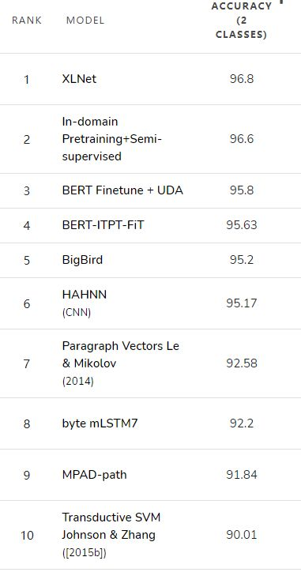

# 说明

## glove.6B.zip

glove预训练词向量，也可以自己使用想用的词向量，使用方法参见https://blog.csdn.net/bqw18744018044/article/details/89575127

## aclImdb_v1.tar.gz

所使用的数据集

具体可见：Maas, A. L., Daly, R. E., Pham, P. T., Huang, D., Ng, A. Y., & Potts, C. (2011, June). Learning word vectors for sentiment analysis. In Proceedings of the 49th annual meeting of the association for computational linguistics: Human language technologies-volume 1 (pp. 142-150). Association for Computational Linguistics.

## IMDb.py

数据集的基本处理代码

## 模型评价指标

预测准确率

## SOTA方法准确率

可能有用的资料：

https://arxiv.org/pdf/1905.05583v3.pdf