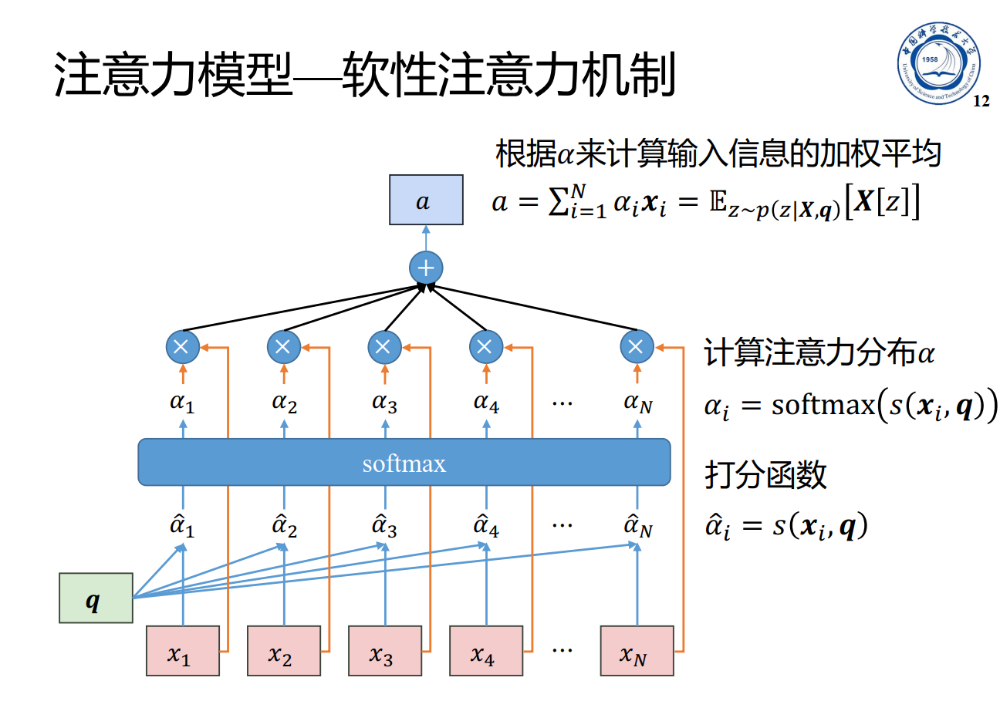
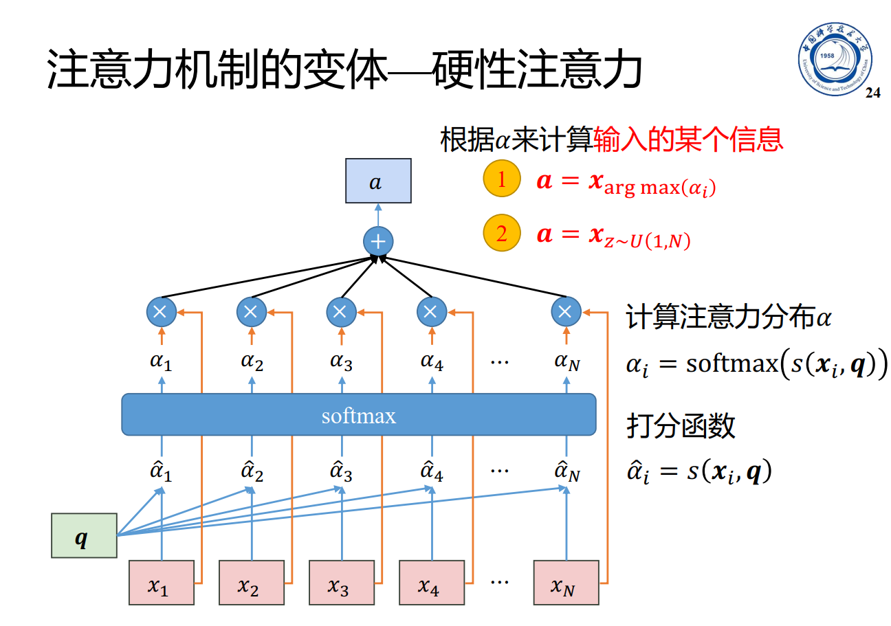
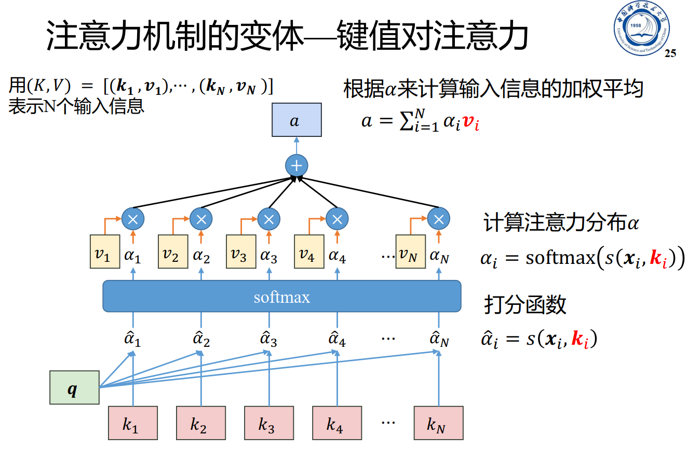
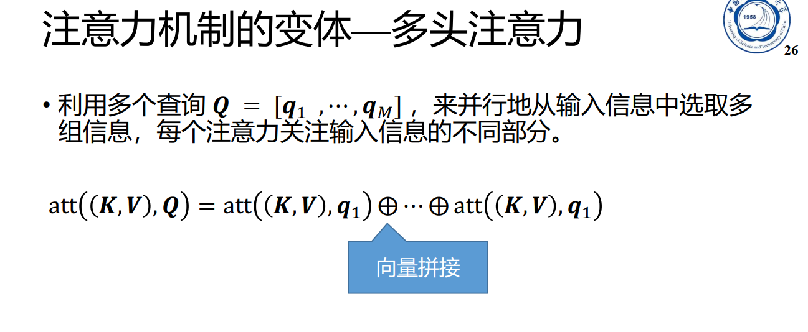
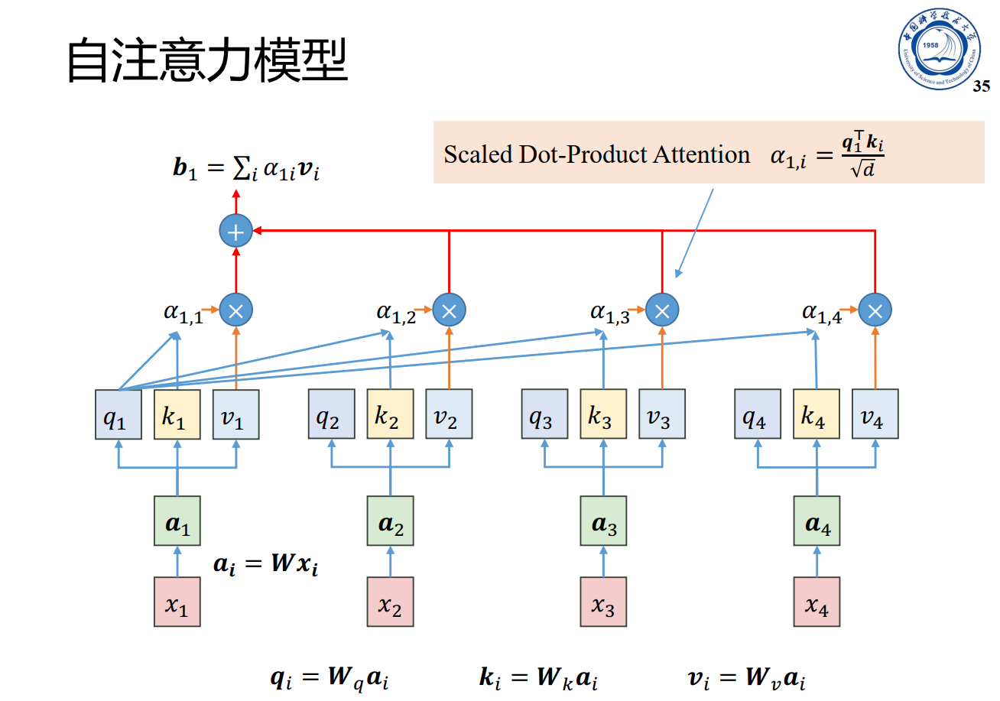
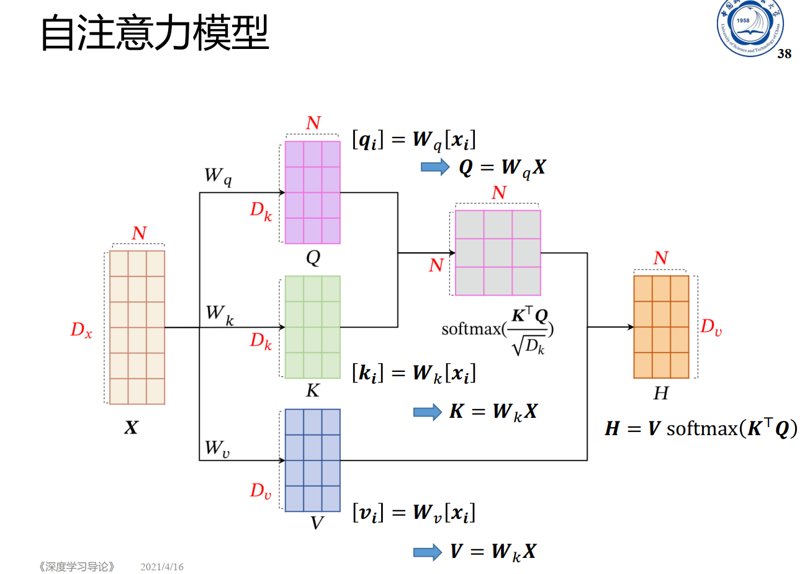
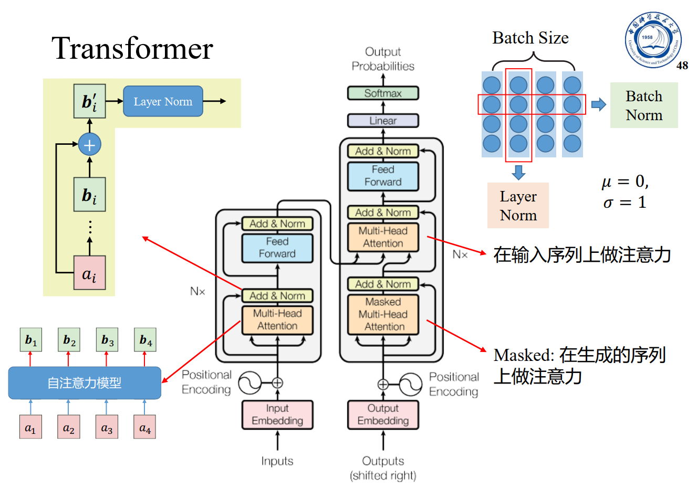
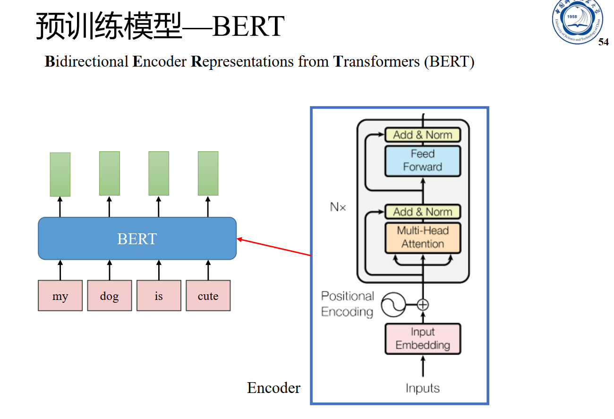

# 实验四：BERT

姓名：刘威

学号：PB18010469


## 实验目的

* 了解并熟悉Attention机制的原理
* 了解self-attention的原理以及transformer的结构
* 学会使用 bert 预训练模型完成文本分类任务


## 实验原理


















## 实验内容

编写BERT的语言模型，并基于训练好的词向量，利用少量的训练数据，微调BERT模型用于文本分类，并和之前的RNN模型进行对比分析

数据集：aclIMDB

## 实验结果

+ 实验使用`pytorch`进行
+ 使用了`Huggingface`维护的`transformers`库中的预训练bert模型`bert-base-uncased`.


### 源码结构及说明

#### 数据预处理部分

使用`transformer`库处理文本, 使得输入符合bert模型的要求

将`train/`目录下的数据集划分为`train/validation`, 划分比例为`0.8/0.2`.

#### 模型部分

取bert模型的输出中`[CLS]`对应的隐藏层，作为二分类全连接的输入。

模型定义如下：

```python
import torch
import torch.nn as nn
from transformers import BertModel

class BertClassifier(nn.Module):
    def __init__(self, freeze_bert=False):
        super(BertClassifier, self).__init__()
        D_in, H, D_out = 768, HIDDEN_DIM, 2
        # Instantiate BERT model
        self.bert = BertModel.from_pretrained('bert-base-uncased')

        self.classifier = nn.Sequential(
            nn.Linear(D_in, H),
            nn.ReLU(),
            # nn.Dropout(0.5),
            nn.Linear(H, D_out)
        )

        if freeze_bert:
            for param in self.bert.parameters():
                param.requires_grad = False

    def forward(self, input_ids, attention_mask):
        # Feed input to BERT
        outputs = self.bert(input_ids=input_ids,
                            attention_mask=attention_mask)

        # Extract the last hidden state of the token `[CLS]` for classification task
        last_hidden_state_cls = outputs[0][:, 0, :]

        # Feed input to classifier to compute logits
        logits = self.classifier(last_hidden_state_cls)
        return logits
```

### 结果及分析

本实验的可选参数为

```python
HIDDEN_DIM = 32	# 最后的全连接层的隐藏层维度
BATCH_SIZE = 8
N_EPOCHS = 10
MAX_LEN = 256  # 序列的最大长度
LEARNING_RATE = 1e-5
FREEZE_BERT = False  # 是否固定bert的参数
```

此外，本实验固定随机种子：

```python
import torch
import random
import os
import numpy as np

def set_seed(seed=123):
    random.seed(seed)
    np.random.seed(seed)
    os.environ["PYTHONHASHSEED"] = str(seed)
    torch.manual_seed(seed)
    torch.cuda.manual_seed_all(seed)
    # torch.use_deterministic_algorithms(True)
    # torch.backends.cudnn.enabled = False
    torch.backends.cudnn.benchmark = False
    torch.backends.cudnn.deterministic = True
    os.environ["CUBLAS_WORKSPACE_CONFIG"] = ":4096:2"
    
set_seed(2077)
```

设置`FREEZE_BERT`为 `True` 和 `False`, 分别训练模型。每轮训练结束时在验证集上验证，并保存`val_loss`最低的模型用于测试，得到的测试集准确率(%)如下表, RNN和BERT的结果来自于上一次实验的最好结果:

|模型|RNN| LSTM| BERT(Freeze) | BERT(no Freeze) |
|:---:|:---:|:---:|:---:|:---:|
| acc |77.87|86.62| 84.58 | 93.53 |

可以看到，如果固定BERT的参数，只训练最后的全连接层，结果与LSTM差异不大，但如果BERT的参数也进行微调，能够得到远好于 LSTM 的结果。

结果分析：当固定BERT的参数时，BERT 相当于是一个固定的 Embedding 层， 而且这个Embedding 是在大量的语料上训练得到的，可能无法准确的表达我们的任务情景下的语义。而当我们对 BERT的参数也进行微调时，可以使得这种语义的表达更加确切。

## 实验总结

Transformer采用了相较于循环神经网络完全不同的机制：Attention, 不仅能有效地解决循环神经网络无法并行计算的问题，而且能够引入任意距离的依赖关系，在应用到文本这种序列化且有上下文依赖关系的数据时有很好的效果。BERT堆叠了若干transformer encoder结构，并使用完形填空，句子预测的预训练方式，在许多任务上都取得了 SOTA 结果。

本实验采用预训练的 BERT 模型进行情感分析的二分类任务，在提供的数据集上进行微调，取得了远好于LSTM的结果，充分展现了attetion机制以及BERT预训练模型的强大。